# PROJECT ARCHITECTURE HANDBOOK

**Repository:** BEAIASSISTANT (GitHub Repository AI Assistant)  
**Version analyzed:** Backend `2.0.0`, Frontend `1.0.0`  
**Last updated:** August 24, 2026  
**Purpose:** Complete reverse-engineered architecture reference for interviews and deep technical understanding.

---

# Table of Contents

1. [Executive Summary](#1-executive-summary)
2. [Repository Overview](#2-repository-overview)
3. [Technology Stack Deep Dive](#3-technology-stack-deep-dive)
4. [System Architecture](#4-system-architecture)
5. [Complete Request Lifecycle](#5-complete-request-lifecycle)
6. [Every Service Explained](#6-every-service-explained)
7. [Every API Explained](#7-every-api-explained)
8. [Authentication Deep Dive](#8-authentication-deep-dive)
9. [Database Deep Dive](#9-database-deep-dive)
10. [Redis Deep Dive](#10-redis-deep-dive)
11. [Message Queue Deep Dive](#11-message-queue-deep-dive)
12. [Docker Deep Dive](#12-docker-deep-dive)
13. [Nginx Deep Dive](#13-nginx-deep-dive)
14. [Configuration Files](#14-configuration-files)
15. [Codebase Design Patterns](#15-codebase-design-patterns)
16. [SOLID Principles](#16-solid-principles)
17. [Folder-by-Folder Deep Dive](#17-folder-by-folder-deep-dive)
18. [Important Classes Explained](#18-important-classes-explained)
19. [Important Functions Explained](#19-important-functions-explained)
20. [Middleware Flow](#20-middleware-flow)
21. [Error Handling](#21-error-handling)
22. [Logging System](#22-logging-system)
23. [Security Review](#23-security-review)
24. [Performance Analysis](#24-performance-analysis)
25. [Scalability Analysis](#25-scalability-analysis)
26. [CI/CD Pipeline](#26-cicd-pipeline)
27. [Testing Strategy](#27-testing-strategy)
28. [Complete Feature Walkthroughs](#28-complete-feature-walkthroughs)
29. [Sequence Diagrams](#29-sequence-diagrams)
30. [Interview Preparation](#30-interview-preparation)
31. [Explain Like I'm in an Interview](#31-explain-like-im-in-an-interview)
32. [Hidden Gems](#32-hidden-gems)
33. [Improvement Roadmap](#33-improvement-roadmap)
34. [Complete Dependency Graph](#34-complete-dependency-graph)
35. [Startup and Shutdown Lifecycle](#35-startup-and-shutdown-lifecycle)
36. [End-to-End Data Flow](#36-end-to-end-data-flow)

---

# 1. Executive Summary

## What This Project Does

**BEAIASSISTANT** is a Docker-first web platform that ingests a **public GitHub repository**, builds a rich code intelligence layer (AST parsing, dependency graph, knowledge tree, git history analytics, vector embeddings), and lets users **chat with an AI agent** that answers questions with **file/line citations** grounded in indexed source code.

## Business Problem It Solves

Software teams and individual developers spend enormous time onboarding to unfamiliar codebases. Reading README files, tracing imports, grepping symbols, and reconstructing architecture from scattered files is slow and error-prone. This product collapses that workflow into:

1. Paste a GitHub URL → click **Analyze**
2. Explore structure (tree, graph, source viewer)
3. Ask natural-language questions → receive cited answers

## Target Users

| User | Use Case |
|------|----------|
| Developers onboarding to open-source projects | "Where is the application factory defined?" |
| Interview candidates studying repos | Understand architecture without cloning locally |
| Tech leads / architects | Quick dependency and churn analysis |
| Students | Learn how real projects are structured |

## Core Features

- **Repository registration** via public GitHub URL validation
- **Async indexing pipeline** (clone → parse → graph → chunk → embed)
- **Incremental re-index** for changed files only
- **Multi-language AST parsing** (Python, JavaScript, TypeScript, Java) via Tree-sitter
- **Markdown documentation indexing**
- **Dependency graph visualization** (React Flow + Dagre layout)
- **Knowledge tree** (directory → file → symbol hierarchy)
- **Hybrid RAG retrieval** (vector + FTS + symbol + graph expansion)
- **LangGraph agent** with query classification, multi-query retrieval, citation grounding
- **Git history analytics** (commits, churn, co-change, compare)
- **Conversational chat** with conversation persistence
- **Source drawer** with line highlighting from citations

## Why This Architecture Was Chosen

| Decision | Rationale |
|----------|-----------|
| **Docker Compose monorepo** | Zero host dependencies; Postgres/pgvector + Redis as managed services |
| **FastAPI backend** | Async-capable, OpenAPI docs, Pydantic validation, Python ecosystem for ML/RAG |
| **Separate worker process** | Long-running indexing doesn't block API; Redis list decouples enqueue from execution |
| **Postgres + pgvector** | Single database for relational metadata AND vector similarity search |
| **Redis** | Lightweight queue + cache + rate limiting without introducing Kafka/RabbitMQ complexity |
| **Tree-sitter parsers** | Fast, incremental, multi-language AST without running language servers |
| **LangGraph agent** | Explicit retrieval pipeline stages; easier to debug than opaque agent loops |
| **OpenRouter-compatible LLM API** | Provider-agnostic chat + embeddings via OpenAI SDK |

## Technology Stack Overview

```
Frontend:  React 18 + TypeScript + Vite 6 + React Flow + Dagre
Backend:   FastAPI 0.115 + SQLAlchemy 2 + LangGraph 0.2 + OpenAI SDK
Worker:    Same backend image, different entrypoint
Database:  PostgreSQL 15 + pgvector extension
Cache/Q:   Redis 7
Parsing:   Tree-sitter (Python/JS/TS/Java grammars)
LLM:       OpenRouter (GPT-4o-mini default, text-embedding-3-small)
Deploy:    Docker Compose (5 services)
```

## Elevator Pitch (Interview-Ready)

> "I built a Docker-first GitHub code intelligence platform. Users paste a public repo URL; a background worker clones it, parses source with Tree-sitter, builds a dependency graph and hybrid search index in Postgres with pgvector, then a LangGraph agent answers questions using multi-query RAG with mandatory file citations. The React frontend exposes a knowledge tree, interactive dependency graph, and source viewer — all orchestrated via FastAPI, Redis job queue, and Compose with no local toolchain required."

---

# 2. Repository Overview

## Complete Folder Tree

```
BEAIASSISTANT/
├── .env.example                 # Environment template (safe to commit)
├── .gitignore
├── README.md                    # Quick start guide
├── docker-compose.yml           # 5-service orchestration
├── PROJECT_ARCHITECTURE_HANDBOOK.md
├── data/                        # Cloned repos + runtime data (gitignored contents)
│   └── .gitkeep
├── backend/
│   ├── Dockerfile
│   ├── requirements.txt
│   ├── pytest.ini
│   ├── db/
│   │   └── init.sql             # pgvector extension bootstrap
│   ├── app/
│   │   ├── __init__.py
│   │   ├── main.py              # FastAPI app entry
│   │   ├── config.py            # Pydantic settings
│   │   ├── database.py          # SQLAlchemy engine + init_db
│   │   ├── redis_client.py      # Redis singleton
│   │   ├── schemas.py           # Pydantic API models
│   │   ├── api/
│   │   │   ├── __init__.py
│   │   │   └── routes.py        # All REST endpoints
│   │   ├── models/
│   │   │   └── __init__.py      # SQLAlchemy ORM models (all tables)
│   │   ├── agents/
│   │   │   ├── __init__.py
│   │   │   ├── workflow.py      # LangGraph chat agent
│   │   │   ├── tools.py         # Agent tool wrappers
│   │   │   └── query_utils.py   # Query classify/rewrite/grounding
│   │   ├── rag/
│   │   │   ├── __init__.py
│   │   │   ├── chunk_text.py    # Embed/FTS text builders
│   │   │   ├── embeddings.py    # OpenAI client wrappers
│   │   │   ├── fusion.py        # Reciprocal Rank Fusion
│   │   │   ├── prompts.py       # LLM system prompts
│   │   │   ├── reranker.py      # Heuristic + optional LLM rerank
│   │   │   └── retriever.py     # Hybrid search (vector/FTS/symbol/graph)
│   │   ├── parsers/
│   │   │   ├── __init__.py
│   │   │   ├── base.py          # ParseResult dataclasses
│   │   │   ├── python_parser.py
│   │   │   ├── javascript_parser.py
│   │   │   ├── typescript_parser.py
│   │   │   └── java_parser.py
│   │   ├── services/
│   │   │   ├── __init__.py
│   │   │   ├── cache.py         # Redis JSON cache
│   │   │   ├── file_discovery.py # Clone, walk, language detect
│   │   │   ├── github_service.py # URL parse + GitHub API
│   │   │   ├── git_history_service.py
│   │   │   ├── graph_service.py
│   │   │   ├── indexing_pipeline.py # Main indexing orchestrator
│   │   │   ├── knowledge_service.py
│   │   │   ├── markdown_chunking.py
│   │   │   ├── parser_service.py
│   │   │   ├── rag_service.py   # Chunk + embed pipeline
│   │   │   └── repository_service.py
│   │   └── workers/
│   │       ├── __init__.py
│   │       └── indexing_worker.py
│   └── tests/
│       ├── eval_questions.json
│       ├── test_agent_v2.py
│       ├── test_github_url.py
│       ├── test_git_history.py
│       ├── test_health.py
│       ├── test_java_parser.py
│       ├── test_python_parser.py
│       └── test_rag_upgrade.py
├── frontend/
│   ├── Dockerfile
│   ├── package.json
│   ├── package-lock.json
│   ├── tsconfig.json
│   ├── vite.config.ts
│   ├── index.html
│   └── src/
│       ├── main.tsx
│       ├── App.tsx              # Root state + orchestration
│       ├── api.ts               # HTTP client
│       ├── styles.css
│       ├── vite-env.d.ts
│       ├── WorkspaceShell.tsx
│       ├── TopHeader.tsx
│       ├── LeftRail.tsx
│       ├── ChatPanel.tsx
│       ├── RightSidebar.tsx
│       ├── SourceDrawer.tsx
│       ├── KnowledgeTree.tsx
│       ├── GraphView.tsx
│       └── graphUtils.ts
├── parsers/
│   └── __init__.py              # Empty stub (parsers live in backend)
└── worker/
    ├── Dockerfile               # Deprecated; Compose uses backend image
    ├── requirements.txt
    └── worker.py                # Deprecated stub
```

## Folder Responsibilities

### Root

| Path | Purpose | Key Files | Dependencies |
|------|---------|-----------|--------------|
| `/` | Project orchestration | `docker-compose.yml`, `.env.example`, `README.md` | Docker |
| `data/` | Persistent clone storage | `.gitkeep` | Mounted into backend + worker at `/data` |

### `backend/`

| Path | Purpose | Key Files |
|------|---------|-----------|
| `app/main.py` | HTTP server bootstrap | FastAPI app, CORS, router mount, `init_db` on startup |
| `app/api/` | REST layer | `routes.py` — all endpoints |
| `app/models/` | Persistence schema | 15+ SQLAlchemy models |
| `app/services/` | Business logic | Indexing, parsing, graph, RAG chunking, GitHub |
| `app/agents/` | Conversational AI | LangGraph workflow + tools |
| `app/rag/` | Retrieval quality | Hybrid search, RRF, reranking, embeddings |
| `app/parsers/` | Static analysis | Tree-sitter per language |
| `app/workers/` | Background jobs | Redis BLPOP consumer |
| `db/init.sql` | DB bootstrap | `CREATE EXTENSION vector` |
| `tests/` | Unit tests | Parser, agent, RAG, URL tests |

### `frontend/`

| Path | Purpose | Key Files |
|------|---------|-----------|
| `src/App.tsx` | Application controller | Repo lifecycle, polling, chat state |
| `src/api.ts` | Backend integration | Fetch wrapper + types |
| `src/GraphView.tsx` | Dependency visualization | React Flow + Dagre |
| `src/ChatPanel.tsx` | Q&A UI | Messages, citations |
| `src/SourceDrawer.tsx` | Code viewer | Line highlighting |

### `worker/` (Legacy)

Deprecated. Docker Compose runs `python -m app.workers.indexing_worker` using the **backend image**.

---

# 3. Technology Stack Deep Dive

## Docker & Docker Compose

| Aspect | Detail |
|--------|--------|
| **Why** | Eliminates "works on my machine"; bundles Postgres, Redis, API, worker, UI |
| **Role** | Local dev + demo deployment |
| **Version** | Compose file format v3 (implicit); images: `python:3.11-slim`, `node:20-alpine`, `pgvector/pgvector:pg15`, `redis:7` |
| **Alternatives** | Kubernetes (production scale), Podman, bare metal |
| **Interview answer** | "We chose Compose for simplicity — five services with health-check-gated startup. Production would add an ingress, secrets manager, and horizontal worker scaling." |

## FastAPI 0.115.6

| Aspect | Detail |
|--------|--------|
| **Why** | Typed Python API, automatic OpenAPI at `/docs`, Pydantic v2 integration |
| **Role** | Single REST API for repo CRUD, indexing control, graph/tree/files, chat |
| **Alternatives** | Django REST, Flask, Node/Express, Spring Boot |
| **Interview answer** | "FastAPI gives us schema-validated request/response models and dependency-injected DB sessions with minimal boilerplate." |

## Uvicorn 0.32.1

ASGI server running `app.main:app` on port 8000 inside the backend container.

## SQLAlchemy 2.0.36 + psycopg 3

| Aspect | Detail |
|--------|--------|
| **Why** | Mature ORM; `create_all` for schema bootstrap; raw SQL for pgvector queries |
| **Role** | All persistence except vector distance queries (raw SQL with `<=>` operator) |
| **Alternatives** | Prisma, Django ORM, async SQLAlchemy |
| **Interview answer** | "We use declarative models with relationship cascades. Vector search uses parameterized raw SQL because pgvector operators aren't first-class in the ORM." |

## PostgreSQL 15 + pgvector 0.3.6

| Aspect | Detail |
|--------|--------|
| **Why** | ACID metadata + HNSW/IVFFlat-capable vector column in one store |
| **Role** | Repos, files, symbols, graph, chunks with `embedding vector(1536)`, FTS `search_tsv` |
| **Alternatives** | Pinecone, Weaviate, Qdrant, Elasticsearch |
| **Interview answer** | "Colocating vectors with relational joins to `files` avoids sync problems between a vector DB and Postgres." |

## Redis 5.2.1 (Server 7)

| Aspect | Detail |
|--------|--------|
| **Why** | Simple list queue + TTL cache + atomic counters |
| **Role** | Index job queue (`index_jobs`), chat response cache, rate limiting |
| **Alternatives** | RabbitMQ, Kafka, SQS, Celery broker |
| **Interview answer** | "Redis LIST with RPUSH/BLPOP is sufficient for a single-worker demo. At scale we'd add consumer groups or Celery." |

## LangGraph 0.2.60 + LangChain Core 0.3.28

| Aspect | Detail |
|--------|--------|
| **Why** | Explicit state machine for agent steps vs. opaque ReAct loops |
| **Role** | `classify → retrieve → compose_answer → source_check` pipeline |
| **Alternatives** | Raw OpenAI function calling, AutoGen, custom FSM |
| **Interview answer** | "LangGraph makes each retrieval stage testable and observable. We fan in RAG + CODE + GRAPH + HISTORY + DOCS based on query classification." |

## OpenAI SDK 1.x (via OpenRouter)

| Aspect | Detail |
|--------|--------|
| **Why** | Standard chat + embeddings API |
| **Role** | `chat_completion`, `embed_texts` with configurable `LLM_BASE_URL` |
| **Default models** | `openai/gpt-4o-mini`, `openai/text-embedding-3-small` (1536 dims) |
| **Alternatives** | Anthropic direct, Azure OpenAI, local Ollama |
| **Interview answer** | "OpenRouter lets us swap models via env vars without code changes." |

## Tree-sitter 0.23.x

| Aspect | Detail |
|--------|--------|
| **Why** | Incremental, error-tolerant parsing; shared grammar model across languages |
| **Role** | Extract classes, functions, methods, imports, calls |
| **Alternatives** | language-specific AST (ast module), Sourcegraph SCIP, LSP |
| **Interview answer** | "Tree-sitter gives us structural symbols without executing code or needing per-language compilers." |

## GitPython 3.1.43

Clone, fetch, diff, commit iteration for indexing and history analytics.

## React 18 + Vite 6 + TypeScript 5.7

SPA with hot reload in dev; production build served by `serve` on port 3000.

## React Flow (@xyflow/react 12) + Dagre

Interactive dependency graph with layout, filtering, neighborhood focus.

## Components That Do NOT Exist

| Component | Status |
|-----------|--------|
| Nginx / reverse proxy | **Not present** — ports exposed directly |
| Kubernetes manifests | **Not present** |
| JWT / OAuth / session auth | **Not present** — open API |
| RabbitMQ / Kafka | **Not present** — Redis list queue |
| WebSockets / SSE | **Not present** — polling for index status |
| Terraform / IaC | **Not present** |
| GitHub Actions CI/CD | **Not present** |
| Prisma / Alembic migrations | **Not present** — `create_all` + manual `_ensure_columns` |
| OpenAPI spec file (static) | Auto-generated by FastAPI at runtime |

---

# 4. System Architecture

## High-Level Architecture

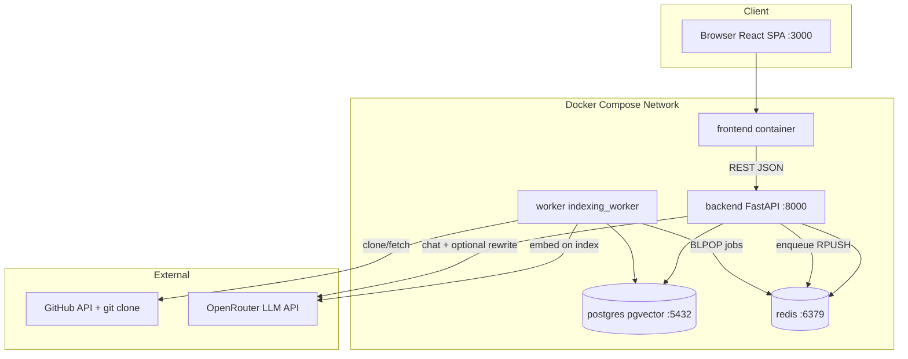

### Arrow Explanations

| Arrow | Meaning |
|-------|---------|
| Browser → FE | User loads static React bundle |
| FE → BE | All API calls to `http://localhost:8000/api/*` (configurable via `VITE_API_BASE`) |
| BE → PG | CRUD repos, files, chat messages; read graph/tree |
| BE → RD | Rate limits, chat cache, enqueue index jobs |
| WK → RD | Blocking pop from `index_jobs` queue |
| WK → PG | Write parsed artifacts, embeddings during indexing |
| WK → GH | `git clone`, `fetch`, file discovery |
| BE/WK → LLM | Chat answers, query rewrite, embeddings, optional rerank/enrichment |

## Service Communication

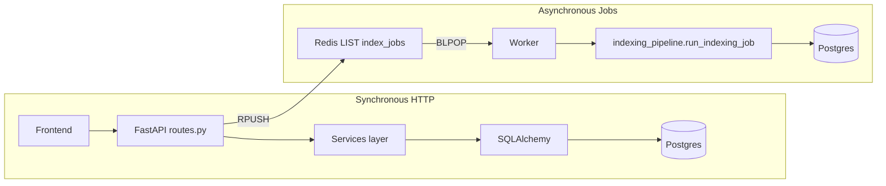

## Client-Server Flow

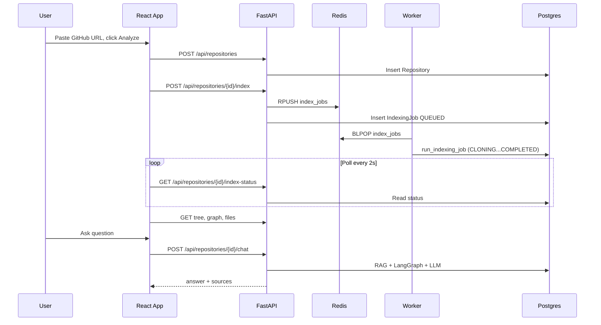

## External Systems

| System | Integration Point | File |
|--------|-------------------|------|
| GitHub REST API | Repo metadata (public/private, default branch) | `backend/app/services/github_service.py` |
| GitHub HTTPS git | Clone with optional token auth | `backend/app/services/file_discovery.py` |
| OpenRouter | Chat + embeddings | `backend/app/rag/embeddings.py` |

---

# 5. Complete Request Lifecycle

## 5.1 Health Check — `GET /api/health`

```
Browser (optional) → FastAPI router → health() → {"status":"ok"}
```

No middleware beyond CORS. No DB. Used by Docker healthcheck.

## 5.2 Create Repository — `POST /api/repositories`

| Stage | Component | Action |
|-------|-----------|--------|
| 1. Browser | `App.analyze()` | Calls `api.createRepo(url)` |
| 2. HTTP | FastAPI | Route `create_repo` in `routes.py` |
| 3. Validation | Pydantic `RepoCreate` | Validates `url: str` |
| 4. DI | `get_db()` | Yields SQLAlchemy session |
| 5. Service | `create_repository()` | `parse_github_url` → regex validate |
| 6. External | `fetch_repo_metadata()` | GET `api.github.com/repos/{owner}/{name}` |
| 7. Business rule | | Rejects private repos |
| 8. DB | `Repository` insert | status=`CREATED` |
| 9. Response | `RepoOut` | UUID, owner, name, default_branch |

**curl:**
```bash
curl -s -X POST http://localhost:8000/api/repositories \
  -H "Content-Type: application/json" \
  -d '{"url":"https://github.com/pallets/flask"}'
```

## 5.3 Start Indexing — `POST /api/repositories/{repo_id}/index`

| Stage | Action |
|-------|--------|
| Rate limit | `check_rate_limit("index:{repo_id}", 10/min)` via Redis INCR |
| Body parse | `{incremental: bool, branch: string|null}` |
| Job create | `IndexingJob` row, `repo.status = QUEUED` |
| Queue | `RPUSH index_jobs` JSON payload |
| Worker pickup | `BLPOP` → `run_indexing_job()` |

**Indexing pipeline stages** (`indexing_pipeline.py`):

```
QUEUED → CLONING (0.1) → ANALYZING (0.25) → PARSING (0.4)
→ GRAPH_BUILDING (0.6) → CHUNKING (0.75) → EMBEDDING (0.9) → COMPLETED (1.0)
```

## 5.4 Chat Request — `POST /api/repositories/{repo_id}/chat`

| Stage | Component | Detail |
|-------|-----------|--------|
| 1 | Rate limit | 30 req/min per repo |
| 2 | Cache check | If no `conversation_id`, check Redis `cache:chat:{repo}:{hash}` |
| 3 | Conversation | Load/create `Conversation`, prior `Message` rows |
| 4 | Agent | LangGraph: classify → retrieve → answer → source_check |
| 5 | Retrieve | Multi-query hybrid RAG + optional CODE/GRAPH/HISTORY/DOCS |
| 6 | LLM | `build_answer_messages` → `chat_completion` temperature=0 |
| 7 | Grounding | `is_grounded()` or rewrite via `source_check` node |
| 8 | Persist | Save user + assistant messages with `sources` JSONB |
| 9 | Cache | Store response for stateless first messages (TTL 300s) |
| 10 | Response | `ChatResponse` with citations |

**curl:**
```bash
curl -s -X POST http://localhost:8000/api/repositories/{REPO_ID}/chat \
  -H "Content-Type: application/json" \
  -d '{"message":"Where is create_app defined?"}'
```

## 5.5 Index Status Polling (Frontend)

```
useEffect → setInterval 2000ms → GET /index-status
→ if COMPLETED: loadArtifacts (tree, graph, files)
→ if FAILED: show error
```

No WebSocket — client-side polling only.

---

# 6. Every Service Explained

## 6.1 Backend API Service (FastAPI)

**Purpose:** HTTP gateway for all user and frontend operations.

**Startup flow** (`main.py`):
1. Load settings via `@lru_cache get_settings()`
2. Create FastAPI app v2.0.0
3. Add CORS middleware from `CORS_ORIGINS`
4. Mount `/api` router
5. On startup: `init_db()` — extension + `create_all` + column migrations

**Shutdown:** Default Uvicorn graceful stop; no custom teardown hooks.

**Dependency injection:**
- `get_db()` — per-request SQLAlchemy session with `finally: close()`

## 6.2 Indexing Worker Service

**Purpose:** Consume Redis queue jobs and run full indexing pipeline.

**Startup** (`indexing_worker.py`):
```python
init_db()
r = get_redis()
while True:
    item = r.blpop("index_jobs", timeout=5)
    # process job
```

**Command:** `python -m app.workers.indexing_worker`  
**Image:** Same as backend (`./backend` Dockerfile)

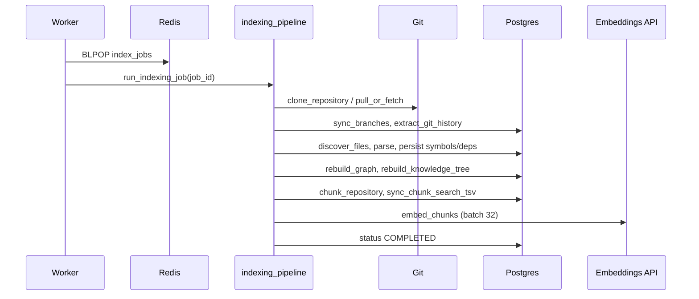

## 6.3 Frontend Service

**Purpose:** Static SPA served on port 3000.

**Build:** Vite → `dist/` → `serve -s dist -l 3000`  
**Runtime:** No SSR; all data from REST API at `VITE_API_BASE` or `http://localhost:8000`

**Key state in `App.tsx`:**
- `repo`, `status`, `tree`, `graph`, `files`, `messages`, `conversationId`
- Polling, analyze/incremental flows, citation → source drawer

## 6.4 Postgres Service

**Purpose:** Primary data store + vector search + FTS.

**Init:** `init.sql` creates `vector` extension; ORM creates tables on backend startup.

## 6.5 Redis Service

**Purpose:** Job queue, response cache, rate limit counters.

---

# 7. Every API Explained

## Endpoint Table

| Endpoint | Method | Purpose |
|----------|--------|---------|
| `/api/health` | GET | Liveness probe |
| `/api/repositories` | POST | Register GitHub repo |
| `/api/repositories` | GET | List all repos |
| `/api/repositories/{repo_id}` | GET | Get single repo |
| `/api/repositories/{repo_id}/index` | POST | Enqueue indexing job |
| `/api/repositories/{repo_id}/index-status` | GET | Poll job + repo status |
| `/api/repositories/{repo_id}/branches` | GET | List remote branches |
| `/api/repositories/{repo_id}/history` | GET | Commits for path |
| `/api/repositories/{repo_id}/history/churn` | GET | Module/file churn stats |
| `/api/repositories/{repo_id}/history/compare` | GET | Diff two commits |
| `/api/repositories/{repo_id}/tree` | GET | Knowledge tree JSON |
| `/api/repositories/{repo_id}/graph` | GET | Graph nodes + edges |
| `/api/repositories/{repo_id}/files` | GET | File index list |
| `/api/repositories/{repo_id}/files/{file_id}` | GET | File content |
| `/api/repositories/{repo_id}/symbols/{symbol}` | GET | Symbol search |
| `/api/repositories/{repo_id}/dependencies/{symbol}` | GET | Outgoing deps |
| `/api/repositories/{repo_id}/references/{symbol}` | GET | Incoming refs |
| `/api/repositories/{repo_id}/chat` | POST | Agent Q&A |

## Per-Endpoint Details

### `POST /api/repositories/{repo_id}/index`

- **Request:** `{"incremental": false, "branch": "main"}`
- **Validation:** Pydantic `IndexRequest`; repo must exist (404)
- **Rate limit:** 10/min per repo
- **Logic:** `enqueue_index()` — creates job, sets QUEUED, RPUSH Redis
- **Response:** `IndexJobOut` with job_id, status, progress, branch, timings, metrics

### `GET /api/repositories/{repo_id}/graph`

- **Logic:** `get_graph()` — all `GraphNode` + `GraphEdge` for repo
- **Response:** `GraphOut` with typed nodes/edges for React Flow

### `POST /api/repositories/{repo_id}/chat`

- **Request:** `{"message": "...", "conversation_id": "uuid|null"}`
- **Errors:** 404 repo, 429 rate limit
- **Side effects:** Inserts 2 Message rows; may cache in Redis

---

# 8. Authentication Deep Dive

## Status: **NOT IMPLEMENTED**

This application has **no authentication or authorization layer**.

| Concern | Current State |
|---------|---------------|
| JWT | Not used |
| Refresh tokens | Not used |
| Session cookies | Not used |
| API keys (user-facing) | Not used |
| Role checks | Not used |
| Middleware auth | Only CORS |

**Implications:**
- Any client reaching `:8000` can create repos, trigger indexing (costly), and consume LLM quota
- `GITHUB_TOKEN` and `LLM_API_KEY` are server-side secrets only
- Frontend shows placeholder user "Maruthi Srinivas" — cosmetic only

**If adding auth (recommended for production):**
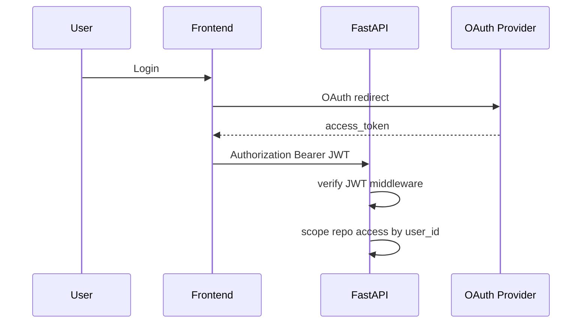

---

# 9. Database Deep Dive

## ER Diagram

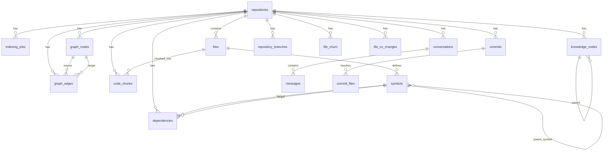

## Table Reference

### `repositories`

| Column | Type | Purpose |
|--------|------|---------|
| id | UUID PK | Primary identifier |
| github_url | VARCHAR(512) | Normalized GitHub URL |
| owner, name | VARCHAR(255) | Parsed from URL |
| default_branch | VARCHAR(255) | From GitHub API / checkout |
| commit_hash | VARCHAR(64) | HEAD at index time |
| status | ENUM RepoStatus | Pipeline state mirror |
| local_path | VARCHAR(1024) | `/data/{repo_id}` clone path |
| error | TEXT | Last failure message |
| created_at, updated_at | TIMESTAMPTZ | Audit |

**Why:** Central entity linking all indexed artifacts.

### `indexing_jobs`

Tracks async job progress with `progress` float 0–1, `incremental`, `branch`, `timings` JSONB, `metrics` JSONB.

### `files`

| Column | Purpose |
|--------|---------|
| path | Relative path (unique per repo) |
| language | python/javascript/typescript/java/markdown |
| size | Byte size |
| hash | SHA256 content hash |
| content | Full file text (enables source API + re-chunk) |

**Why:** Source of truth for displayed code and chunk generation.

### `symbols`

AST-extracted entities: name, type (class/function/method), line range, optional parent, signature.

### `dependencies`

Cross-symbol edges: IMPORTS, CALLS, EXTENDS, IMPLEMENTS with source_name/target_name strings.

### `graph_nodes` / `graph_edges`

Visualization layer derived from symbols + dependencies. Node types: CLASS, FUNCTION, METHOD, MODULE, SYMBOL, EXTERNAL.

### `knowledge_nodes`

Hierarchical tree: repository → directory → file → symbol. Optional LLM-enriched `description`.

### `code_chunks`

RAG units with `content`, line range, `class_name`, `method_name`, `embedding vector(1536)`, `search_tsv tsvector`, `tsv` text blob.

### `conversations` / `messages`

Chat persistence. Messages store `role`, `content`, `sources` JSONB array.

### Git analytics tables

| Table | Purpose |
|-------|---------|
| `commits` | SHA, author, message, timestamp |
| `commit_files` | Files touched per commit (A/M/D) |
| `file_churn` | Change count per path |
| `file_co_changes` | Pairs of files changed together |
| `repository_branches` | Remote branch list + is_indexed flag |

## Indexes

- `ix_code_chunks_search_tsv` — GIN on `search_tsv` for FTS
- Unique constraints: `(repository_id, path)` on files, `(repository_id, sha)` on commits, etc.

## Migrations

**No Alembic.** Schema managed by:
1. `Base.metadata.create_all()` on startup
2. `_ensure_columns()` for additive ALTERs on existing volumes
3. `backend/db/init.sql` for fresh Postgres volumes

---

# 10. Redis Deep Dive

## Uses

| Key Pattern | Purpose | TTL |
|-------------|---------|-----|
| `index_jobs` | LIST queue for indexing | None |
| `cache:chat:{repo_id}:{hash}` | Cached chat responses | 300s |
| `rl:{key}:{bucket}` | Rate limit counter | 60s |

## Caching Strategy

**Chat cache** (`cache.py`):
- Key = SHA256(first 16 chars) of message + repo_id
- Only for **first message** in conversation (`conversation_id is None`)
- Stores full `ChatResponse` JSON
- **Invalidation:** TTL expiry only — no invalidation on re-index

## Rate Limiting

```python
bucket = f"rl:{key}:{now // 60}"
count = redis.incr(bucket)
if count == 1: redis.expire(bucket, 60)
if count > limit: HTTP 429
```

Keys: `chat:{repo_id}`, `index:{repo_id}`

## Performance Benefits

- Avoids duplicate LLM calls for identical first questions
- Protects against indexing/chat abuse
- Sub-millisecond queue operations vs. DB polling

---

# 11. Message Queue Deep Dive

## Implementation: Redis LIST (not RabbitMQ/Kafka)

| Role | Operation | File |
|------|-----------|------|
| Producer | `RPUSH index_jobs payload` | `repository_service.py` |
| Consumer | `BLPOP index_jobs timeout=5` | `indexing_worker.py` |

## Message Payload

```json
{
  "job_id": "uuid",
  "repository_id": "uuid",
  "incremental": false,
  "branch": "main"
}
```

## Flow Diagram

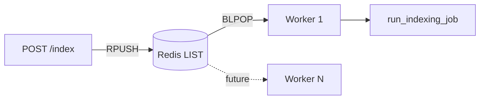

## Acknowledgements

**At-most-once semantics:** Job popped from Redis before processing. Crash mid-job = lost queue entry (job row remains in FAILED or stuck state).

## Retry Logic

Worker loop catches exceptions, logs, sleeps 2s, continues. **No automatic job retry.**

## Dead Letter Queue

**Not implemented.** Failed jobs set `JobStatus.FAILED` with error text in Postgres.

---

# 12. Docker Deep Dive

## 12.1 Backend Dockerfile

**File:** `backend/Dockerfile`

| Layer | Instruction | Purpose |
|-------|-------------|---------|
| Base | `FROM python:3.11-slim` | Minimal Python runtime |
| System deps | `apt-get install git build-essential curl` | Git clone + tree-sitter compile |
| Workdir | `/app` | Application root |
| Dependencies | `COPY requirements.txt` + `pip install` | Cached layer when reqs unchanged |
| Source | `COPY . /app` | Application code |
| Env | `PYTHONPATH=/app`, `DATA_DIR=/data` | Import path + clone mount |
| Default CMD | `uvicorn app.main:app --host 0.0.0.0 --port 8000` | Overridden by Compose for worker |

**Build caching:** Requirements copied before source for efficient rebuilds.

## 12.2 Frontend Dockerfile

**File:** `frontend/Dockerfile`

Multi-stage:
1. **build:** `node:20-alpine` → `npm install` → `npm run build` → `dist/`
2. **runtime:** `serve -s dist -l 3000` on port 3000

No nginx — static files served directly by `serve`.

## 12.3 Worker Container

Uses **same backend image** with command override:
```yaml
command: ["python", "-m", "app.workers.indexing_worker"]
```

Legacy `worker/Dockerfile` exists but is **not used** by Compose.

## 12.4 docker-compose.yml

### Services & Startup Order

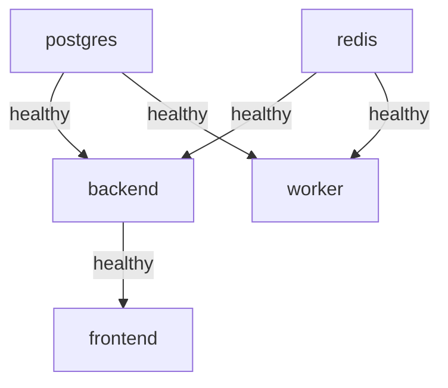

| Service | Image/Build | Ports | Volumes | Healthcheck |
|---------|-------------|-------|---------|-------------|
| postgres | pgvector/pgvector:pg15 | 5432 | pgdata + init.sql | pg_isready |
| redis | redis:7 | 6379 | none | redis-cli ping |
| backend | build ./backend | 8000 | ./data:/data | GET /api/health |
| worker | build ./backend | none | ./data:/data | none |
| frontend | build ./frontend | 3000 | none | depends on backend |

**Shared volume:** `./data` mounted at `/data` for git clones (`/data/{repo_uuid}/`).

---

# 13. Nginx Deep Dive

## Status: **NOT PRESENT**

This repository does **not** include Nginx or any reverse proxy configuration.

**Current exposure:**
- Frontend: `localhost:3000` (serve static)
- Backend: `localhost:8000` (uvicorn direct)
- Postgres/Redis: exposed for debugging only

**Production recommendation:** Add nginx or Traefik for:
- TLS termination
- Single origin (`/` → frontend, `/api` → backend)
- gzip, rate limiting at edge
- Hide database ports

---

# 14. Configuration Files

## `.env.example` — Complete Variable Reference

| Variable | Default | Purpose | Security |
|----------|---------|---------|----------|
| `LLM_API_KEY` | empty | OpenRouter/API key for chat + embeddings | **Secret** — never commit `.env` |
| `LLM_BASE_URL` | `https://openrouter.ai/api/v1` | OpenAI-compatible endpoint | Public |
| `LLM_MODEL` | `openai/gpt-4o-mini` | Chat model slug | Public |
| `EMBEDDING_MODEL` | `openai/text-embedding-3-small` | Embedding model | Public |
| `EMBEDDING_DIMENSIONS` | `1536` | Vector column size — must match model | Changing requires re-embed |
| `DATABASE_URL` | `postgresql+psycopg://...@postgres:5432/app_db` | SQLAlchemy connection | Contains password in dev |
| `REDIS_URL` | `redis://redis:6379/0` | Redis connection | Dev only |
| `GITHUB_TOKEN` | empty | Optional — raises GitHub API rate limits | **Secret** if set |
| `DATA_DIR` | `/data` | Clone root inside container | Path only |
| `INDEX_QUEUE_KEY` | `index_jobs` | Redis list name | Public |
| `CORS_ORIGINS` | `http://localhost:3000` | Allowed browser origins | Security boundary |
| `GIT_CLONE_DEPTH` | `200` | Shallow clone depth | Affects history completeness |
| `GIT_HISTORY_MAX_COMMITS` | `200` | Max commits extracted | Performance cap |
| `RERANK_MODE` | `heuristic` | `heuristic` or `llm` reranking | `llm` adds API cost |
| `RETRIEVE_CANDIDATES` | `40` | Hybrid search pool size | Latency vs recall |
| `CONTEXT_CHUNKS` | `10` | Chunks sent to LLM | Token cost control |

## `backend/app/config.py` — Additional Settings (not in .env.example)

| Setting | Default | Purpose |
|---------|---------|---------|
| `chat_rate_limit_per_minute` | 30 | Chat rate limit |
| `index_rate_limit_per_minute` | 10 | Index rate limit |

Loaded via Pydantic `BaseSettings` with `env_file=".env"`, `extra="ignore"`.

## `frontend` — Build-time

| Variable | Default | Purpose |
|----------|---------|---------|
| `VITE_API_BASE` | `http://localhost:8000` | Backend URL baked at build |

**Note:** Docker frontend build does not pass `VITE_API_BASE` — defaults to localhost:8000 (works when browser accesses both on host).

## `pytest.ini`

```ini
pythonpath = .
testpaths = tests
```

---

# 15. Codebase Design Patterns

| Pattern | Where Used | Why |
|---------|------------|-----|
| **Repository-like service layer** | `repository_service.py`, `graph_service.py` | Separates HTTP from DB logic |
| **Pipeline / Stage pattern** | `indexing_pipeline.py` status transitions | Observable long-running jobs |
| **Strategy** | `parser_service.py` dispatches by language | Pluggable parsers |
| **Singleton (module-level)** | `get_settings()`, `get_redis()`, `get_graph_app()` | Shared expensive clients |
| **Factory** | `parse_file_content()` returns `ParseResult` | Uniform parser output |
| **Facade** | `agents/tools.py` wraps retriever + graph + git | Simple agent interface |
| **State Machine** | LangGraph `AgentState` nodes | Explicit agent control flow |
| **Adapter** | OpenAI SDK with custom `base_url` | OpenRouter compatibility |
| **Dependency Injection** | FastAPI `Depends(get_db)` | Testable request scope |
| **Template Method** | `_walk_js_like` shared by JS/TS parsers | DRY tree walking |
| **Observer (UI)** | React `useEffect` polling index status | React to async completion |

### Interview: Strategy Pattern in Parsers

> "Each language implements the same `ParseResult` contract. `parser_service.parse_file_content` selects the strategy based on detected language — Open/Closed Principle without modifying callers when adding Go or Rust."

---

# 16. SOLID Principles

## Single Responsibility (SRP)

| Good | Example |
|------|---------|
| ✅ | `github_service.py` — URL parsing + API only |
| ✅ | `chunk_text.py` — pure text helpers, no DB |
| ⚠️ | `routes.py` — all endpoints in one file (acceptable for project size) |
| ⚠️ | `indexing_pipeline.py` — orchestrates entire pipeline (cohesive responsibility) |

## Open/Closed (OCP)

- **Good:** Add new language parser without changing pipeline — register in `parser_service.py`
- **Good:** `rerank_mode` switches heuristic vs LLM without changing retriever

## Liskov Substitution (LSP)

- All parsers return `ParseResult` — interchangeable by `parser_service`

## Interface Segregation (ISP)

- Pydantic schemas split per endpoint (`RepoOut`, `ChatResponse`, etc.) — clients don't depend on unused fields

## Dependency Inversion (DIP)

- Routes depend on service abstractions (functions), not raw SQL
- `get_db()` injected — routes don't create engines
- **Gap:** Services directly import SQLAlchemy models (no repository interfaces) — pragmatic for small codebase

---

# 17. Folder-by-Folder Deep Dive

## `backend/app/agents/`

| File | Responsibility | Public API | Depends On |
|------|----------------|------------|------------|
| `workflow.py` | LangGraph agent | `chat()`, `run_agent()` | tools, query_utils, rag, models |
| `tools.py` | Retrieval wrappers | `search_code`, `find_dependencies`, etc. | retriever, graph, git |
| `query_utils.py` | NLP heuristics | `classify_query`, `rewrite_query`, `is_grounded` | config, embeddings (optional) |

**Lifecycle:** Graph compiled once (`get_graph_app()` singleton), invoked per chat message.

## `backend/app/rag/`

| File | Responsibility |
|------|----------------|
| `retriever.py` | vector_search, keyword_search, symbol_search, hybrid_retrieve |
| `fusion.py` | reciprocal_rank_fusion |
| `reranker.py` | heuristic_rerank, llm_rerank |
| `embeddings.py` | embed_texts (batch 32), chat_completion |
| `prompts.py` | ANSWER_SYSTEM, SOURCE_CHECK_SYSTEM |
| `chunk_text.py` | build_embed_text, build_chunk_tsv |

## `backend/app/parsers/`

Tree-sitter walkers extracting symbols + dependencies per language. Shared dataclasses in `base.py`.

## `backend/app/services/`

| Service | Key Functions |
|---------|---------------|
| `file_discovery.py` | clone_repository, discover_files, pull_or_fetch, changed_files |
| `indexing_pipeline.py` | run_indexing_job |
| `rag_service.py` | chunk_repository, embed_chunks |
| `git_history_service.py` | extract_git_history, compare_commits, get_git_history_context |
| `graph_service.py` | rebuild_graph, expand_graph_neighbors |
| `knowledge_service.py` | rebuild_knowledge_tree, enrich_knowledge_descriptions |
| `repository_service.py` | create_repository, enqueue_index, check_rate_limit |
| `cache.py` | cache_get, cache_set, chat_cache_key |
| `markdown_chunking.py` | chunk_markdown by headings |

## `frontend/src/`

| Component | Responsibility |
|-----------|----------------|
| `App.tsx` | Global state, analyze flow, polling, chat |
| `api.ts` | HTTP client + error formatting |
| `WorkspaceShell.tsx` | Layout grid (header, left, center, right, source) |
| `LeftRail.tsx` | Nav, URL input, branch select, tree |
| `ChatPanel.tsx` | Message UI, citations |
| `GraphView.tsx` | Full-screen React Flow graph |
| `SourceDrawer.tsx` | Syntax-highlighted lines with scroll-to-highlight |
| `graphUtils.ts` | Graph filtering, neighborhood BFS, colors |

## `backend/tests/`

Unit tests without live DB/LLM for parsers, RRF, query utils, citations.

## `data/`

Runtime storage for cloned repositories. Gitignored except `.gitkeep`.

---

# 18. Important Classes Explained

## SQLAlchemy Models (all in `models/__init__.py`)

### `Repository`

- **Fields:** id, github_url, owner, name, default_branch, commit_hash, status, local_path, error, timestamps
- **Relationships:** files, jobs (cascade delete)
- **Interactions:** Created by API; updated by worker through pipeline

### `IndexingJob`

- **Fields:** status, progress, incremental, branch, timings, metrics, error
- **Interactions:** Created on enqueue; updated through `_set_status`

### `CodeChunk`

- **Fields:** content, line range, embedding Vector(1536), search_tsv, symbol metadata
- **Interactions:** Created by `chunk_repository`, embedded by `embed_chunks`, searched by retriever

### `GraphNode` / `GraphEdge`

- Built by `rebuild_graph()` from symbols and dependencies
- Consumed by API + frontend GraphView

## Pydantic Schemas (`schemas.py`)

Request/response contracts decoupled from ORM — enables stable API even if DB changes.

## LangGraph `AgentState` (TypedDict)

```python
repository_id, question, history, kinds, chunks, notes, answer, sources, citation_ok
```

`chunks` and `notes` use `Annotated[list, operator.add]` for fan-in accumulation.

## Class Relationship Diagram

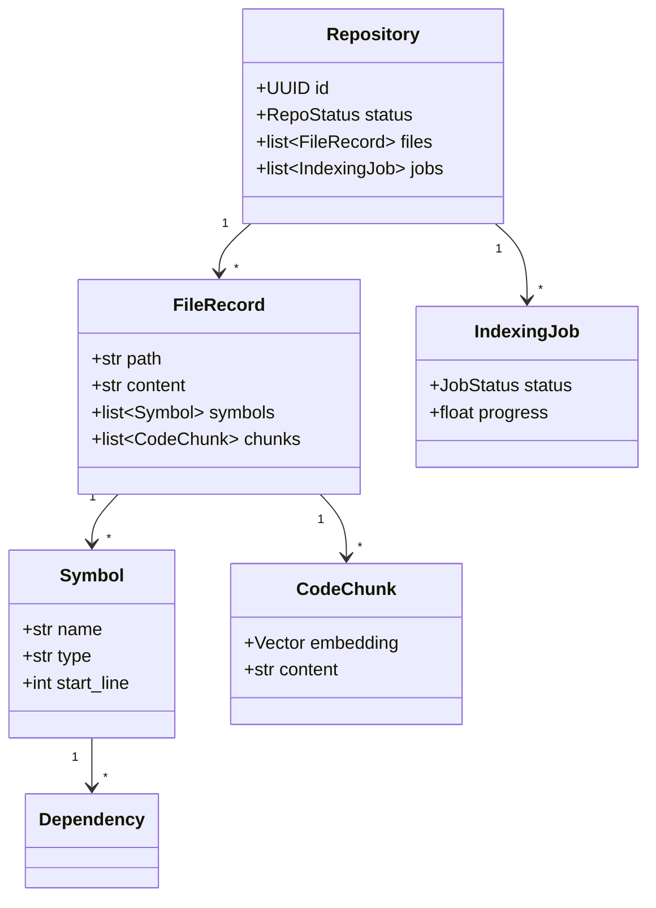

---

# 19. Important Functions Explained

## `run_indexing_job(db, job_id, incremental, branch)`

| Aspect | Detail |
|--------|--------|
| **Input** | Job UUID, incremental flag, branch name |
| **Output** | None; mutates DB + filesystem |
| **Side effects** | Git clone, parse all/changed files, rebuild graph/tree, chunk, embed |
| **Algorithm** | Sequential pipeline with progress checkpoints |
| **Complexity** | O(files × parse_cost + chunks × embed_cost) |

## `hybrid_retrieve(db, repository_id, query, limit)`

| Aspect | Detail |
|--------|--------|
| **Input** | Natural language query |
| **Output** | Ranked list of chunk dicts |
| **Algorithm** | Parallel vector + FTS + symbol + graph expansion → RRF → rerank |
| **Complexity** | O(candidates) DB queries + 1 embedding API call |

## `reciprocal_rank_fusion(ranked_lists, k=60, limit)`

| Aspect | Detail |
|--------|--------|
| **Formula** | score(d) = Σ 1/(k + rank_i(d)) |
| **Dedup key** | `file:start:end` |
| **Complexity** | O(lists × items) |

## `classify_query(question) -> list[str]`

Always includes `RAG`; adds `HISTORY`, `DOCS`, `GRAPH`, `CODE` based on keyword triggers.

## `is_grounded(answer, chunks) -> bool`

Returns True if citations match allowed files, explicit "not found" language, or commit citations with git context.

## `check_rate_limit(key, limit, window_seconds=60)`

Redis INCR with minute bucket — O(1) per request.

## `discover_files(root) -> list[dict]`

Walk filesystem, filter ignored dirs/suffixes, detect language, read UTF-8 content, SHA256 hash.

---

# 20. Middleware Flow

## FastAPI Middleware Stack (Execution Order)

```
Incoming Request
    ↓
CORSMiddleware (allow_origins from settings)
    ↓
Route matching (/api prefix)
    ↓
Dependency injection (get_db)
    ↓
Endpoint handler
    ↓
Response (Pydantic serialization)
```

## What Is NOT Present

| Middleware | Status |
|------------|--------|
| Authentication | ❌ |
| Request ID / correlation | ❌ |
| Structured logging middleware | ❌ |
| Rate limiting middleware | ❌ (done in handlers) |
| GZip | ❌ |
| Request validation beyond Pydantic | ❌ |

## CORS Configuration

```python
CORSMiddleware(
    allow_origins=origins or ["*"],
    allow_credentials=True,
    allow_methods=["*"],
    allow_headers=["*"],
)
```

From `CORS_ORIGINS` env var — default `http://localhost:3000`.

---

# 21. Error Handling

## API Layer (`routes.py`)

| Pattern | Example |
|---------|---------|
| `ValueError` → 400 | Invalid GitHub URL, private repo |
| `HTTPException 404` | Repo/file not found (`get_repository`) |
| `HTTPException 429` | Rate limit exceeded |
| Generic `Exception` → 400 | Logged with `logger.exception`, message in detail |

## Indexing Pipeline

- **Try/except** wraps entire job
- On failure: `db.rollback()`, reload job/repo, `_set_status(FAILED, error=msg[:2000])`
- Incremental fetch failure: fallback to full clone with warning log
- Git history failure: non-fatal — continues with `metrics["history_error"]`
- Knowledge enrichment failure: logged warning, pipeline continues

## Agent / LLM

- LLM failure in `node_answer`: fallback answer with top chunk snippet
- `source_check` failure: returns `ungrounded_refusal()` with candidate files
- `rewrite_query` LLM failure: falls back to regex rewrite

## Frontend (`api.ts`)

- `formatUserError()` maps network errors to user-friendly messages
- Context-aware guidance for incremental vs analyze failures

## Retries

| Component | Retry |
|-----------|-------|
| Worker loop | Sleep 2s on exception, continue |
| Embedding batch | No retry — raises |
| Git fetch | Manual fallback to full clone |
| LLM calls | No automatic retry |

---

# 22. Logging System

## Initialization

- **Backend:** Python default logging (no central config in main.py)
- **Worker:** `logging.basicConfig(level=INFO, format="%(asctime)s %(levelname)s %(name)s %(message)s")`

## Log Levels Used

| Level | Usage |
|-------|-------|
| INFO | Job enqueue, pipeline completion, agent retrieve/answer timing |
| WARNING | Parse failures, FTS fallback, LLM rewrite failure, git history skip |
| ERROR | Missing jobs, embedding failures, indexing exceptions |
| EXCEPTION | Worker loop errors, route failures |

## Structured Logging

**Not implemented.** Logs are plain text strings, not JSON. No correlation IDs across API → worker → LLM.

## Key Log Points

```python
# repository_service.py
logger.info("Enqueued index job %s for repo %s branch=%s", ...)

# workflow.py
logger.info("retrieve repo=%s kinds=%s rewrites=%s chunks=%s ms=%s", ...)
logger.info("agent done citation_ok=%s sources=%s", ...)

# indexing_pipeline.py
logger.info("Indexing completed for repo %s job %s timings=%s metrics=%s", ...)
```

---

# 23. Security Review

## Current Protections

| Area | Status |
|------|--------|
| SQL injection | ✅ SQLAlchemy parameterized queries + text() with bound params |
| Private repo access | ✅ Rejected at GitHub API metadata check |
| Secrets in repo | ✅ `.env` gitignored; `.env.example` has no secrets |
| CORS | ⚠️ Configurable; falls back to `*` if origins empty |

## Gaps & Risks

| Risk | Severity | Detail |
|------|----------|--------|
| No authentication | **High** | Anyone can trigger indexing + LLM usage |
| File content in DB | **Medium** | Full repo stored in Postgres — protect DB access |
| GitHub token in clone URL | **Medium** | `https://{token}@github.com/...` in process memory |
| Rate limits only per repo | **Medium** | No global IP-based limiting |
| XSS in chat UI | **Low** | React escapes text content by default |
| CSRF | **Low** | No cookies/session auth |
| SSRF via GitHub URL | **Low** | URL regex restricts to github.com |

## Password Hashing

**N/A** — no user accounts.

## JWT Security

**N/A** — not implemented.

## Recommendations

1. Add API key or OAuth before any public deployment
2. Never expose Postgres/Redis ports in production Compose
3. Add request ID middleware for audit trails
4. Sanitize/error messages returned to clients (avoid leaking stack traces — currently mostly safe)
5. Rotate `LLM_API_KEY` and `GITHUB_TOKEN` via secrets manager

---

# 24. Performance Analysis

## Bottlenecks

| Bottleneck | Location | Impact |
|------------|----------|--------|
| **Embedding API calls** | `embed_chunks`, `vector_search` | Latency + cost scale with chunk count |
| **Full file content in DB** | `files.content` TEXT | Large repos = large Postgres |
| **Sequential file parsing** | `indexing_pipeline.py` for loop | CPU-bound, single-threaded worker |
| **Shallow clone depth 200** | Git history incomplete for old repos | Analytics accuracy |
| **Chat agent opens new DB session** | `node_retrieve` uses `_db()` | Extra connections per chat |
| **No embedding index tuning** | pgvector queries | May slow at millions of vectors |
| **Frontend polling 2s** | Index status | Unnecessary load during long indexes |

## Expensive Queries

- Vector search: `ORDER BY embedding <=> query LIMIT N` — needs IVFFlat/HNSW index at scale
- FTS: GIN index on `search_tsv` — good for keyword leg
- Full table delete on re-index: `DELETE FROM code_chunks WHERE repository_id = ...`

## Optimization Suggestions

1. Batch parse files with multiprocessing
2. Add pgvector index: `CREATE INDEX ON code_chunks USING hnsw (embedding vector_cosine_ops)`
3. SSE or WebSocket for index progress instead of polling
4. Cache graph/tree responses in Redis post-index
5. Lazy-load file content (store on disk only, not in DB)
6. Single DB session per agent run (pass session through LangGraph state)

---

# 25. Scalability Analysis

## Current Architecture Limits

| Dimension | Limit |
|-----------|-------|
| Workers | 1 consumer assumed; multiple workers possible but no dedup lock |
| API | Single uvicorn process |
| Database | Single Postgres instance |
| Queue | Redis LIST — no partition/sharding |

## Horizontal Scaling Path

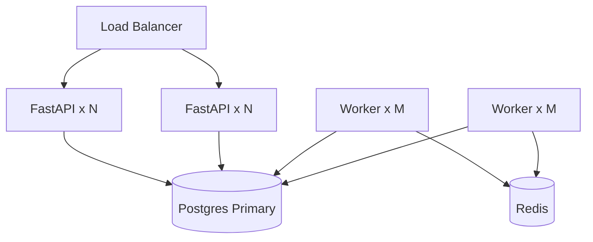

## Stateless Services

- **Backend API:** Stateless except Redis cache/rate limits — ✅ scalable behind LB
- **Worker:** Stateless job processing — ✅ scale with Redis queue
- **Frontend:** Static assets — ✅ CDN scalable

## Caching & Queue Scaling

- Redis Cluster for queue + cache at high throughput
- Consider Celery with visibility timeout for at-least-once job delivery

## "What Happens If Traffic Becomes 100x?"

| Component | Failure Mode |
|-----------|--------------|
| API | Rate limits trigger 429; uvicorn queue depth grows |
| Worker | Index jobs backlog in Redis; multi-hour wait |
| Postgres | Connection pool exhaustion; slow vector queries |
| LLM API | Rate limits / cost explosion on chat |
| Disk `/data` | Clone storage fills volume |

**Mitigation:** Auto-scale workers, pgvector indexes, LLM caching, auth + quotas, object storage for clones, read replicas for search.

---

# 26. CI/CD Pipeline

## Status: **NOT IMPLEMENTED**

No `.github/workflows/`, GitLab CI, Jenkins, or similar found in repository.

## Recommended Pipeline

```yaml
# Conceptual — not in repo
on: [push, pull_request]
jobs:
  test:
    runs-on: ubuntu-latest
    steps:
      - docker compose run backend pytest -q
      - cd frontend && npm ci && npm run build
  lint:
    - ruff check backend/
    - tsc --noEmit
```

**Current test invocation** (manual, per README):
```bash
docker compose exec backend pytest -q
```

---

# 27. Testing Strategy

## Test Files

| File | Coverage |
|------|----------|
| `test_health.py` | GitHub URL parsing contract |
| `test_github_url.py` | URL parser edge cases |
| `test_python_parser.py` | Python AST symbols/deps |
| `test_java_parser.py` | Java parser |
| `test_git_history.py` | History utilities |
| `test_agent_v2.py` | Query classify, citation matching |
| `test_rag_upgrade.py` | RRF, symbol hints, grounding, embed text |

## Test Types Present

| Type | Present |
|------|---------|
| Unit tests | ✅ Parsers, RAG fusion, query utils |
| Integration tests | ❌ No DB/Redis/LLM integration tests |
| E2E tests | ❌ No Playwright/Cypress |
| Mocks | ❌ Minimal — tests pure functions |

## `eval_questions.json`

Evaluation question set for manual/automated RAG quality assessment — not wired to CI.

## Missing Tests (Gaps)

1. `indexing_pipeline` end-to-end with test repo
2. API route tests with TestClient + test DB
3. Worker queue consume/produce
4. Frontend component tests
5. Embedding/LLM mocked integration tests
6. Incremental indexing diff logic
7. Rate limiting behavior

---

# 28. Complete Feature Walkthroughs

## 28.1 Analyze Repository (Full Index)

| Layer | Flow |
|-------|------|
| **UI** | User enters URL → Analyze → createRepo if new → indexRepo |
| **API** | POST index → enqueue Redis → return job |
| **Worker** | Clone → history → discover → parse → graph → tree → chunk → embed |
| **DB** | All artifact tables populated |
| **UI poll** | index-status until COMPLETED → fetch tree/graph/files |

## 28.2 Incremental Update

| Condition | Behavior |
|-----------|----------|
| Prior successful index exists | `pull_or_fetch` → `changed_files` |
| Changed paths only | Re-parse, re-chunk, re-embed affected files |
| Fetch fails | Full clone fallback |
| Branch switch | Forces full re-index |

## 28.3 Chat with Citations

| Layer | Flow |
|-------|------|
| **UI** | POST chat with message + optional conversation_id |
| **Cache** | First message cache lookup |
| **Agent** | Classify → multi-query retrieve → LLM answer → source check |
| **DB** | Conversation + messages persisted |
| **UI** | Render answer + clickable source buttons → SourceDrawer |

## 28.4 Dependency Graph Exploration

| Layer | Flow |
|-------|------|
| **API** | GET graph → nodes/edges from DB |
| **UI** | GraphView with Dagre layout, filter by edge type, focus neighborhood |
| **Interaction** | Click node → open source file via file_id |

## 28.5 Git History Questions

| Trigger | Agent Path |
|---------|------------|
| "highest churn" | HISTORY → `get_git_history_context` → churn stats chunk |
| "compare abc123 def456" | compare_commits → commit:sha citation |
| "why was X changed" | commits_for_path |

## Features NOT Present

- Login / Signup
- Payment
- Notifications (UI button is placeholder)
- Matchmaking
- Email/webhooks

---

# 29. Sequence Diagrams

## Login

**N/A — authentication not implemented.**

## Signup

**N/A — user accounts not implemented.**

## Notification

**N/A — no notification service.**

## Queue Processing

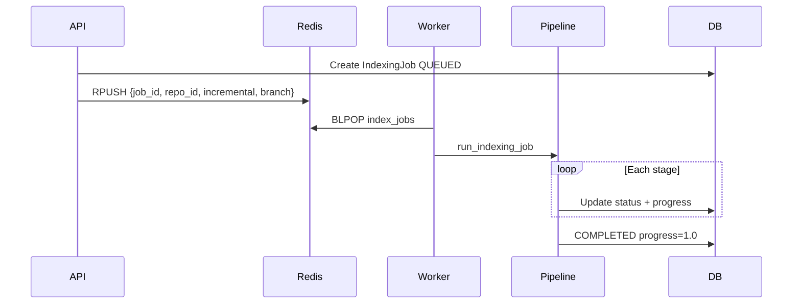

## Cache Hit (Chat)

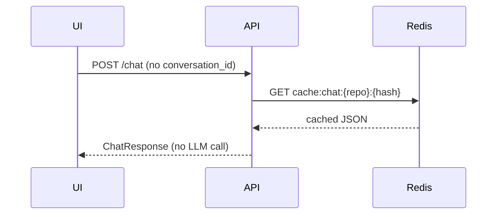

## Cache Miss (Chat)

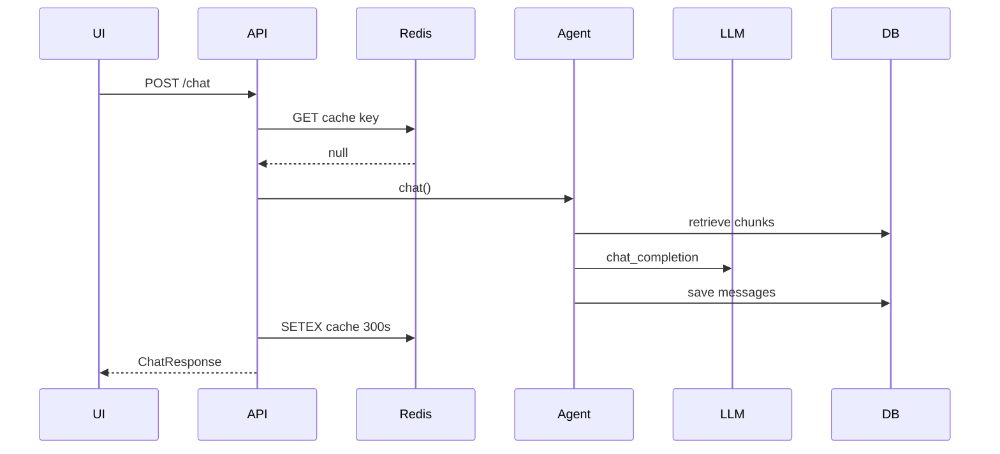

## Database Write (Index Complete)

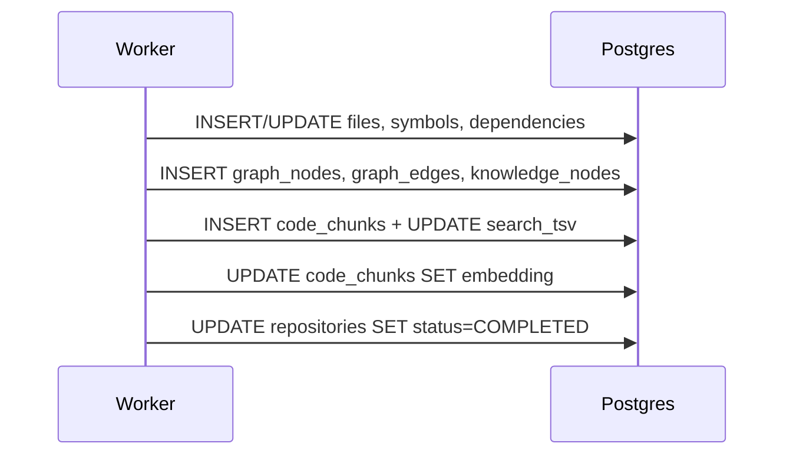

---

# 30. Interview Preparation

Questions derived **only** from this repository. Model answers are concise but complete.

---

## Beginner (20 Questions)

### 1. What does this project do?
**Answer:** It indexes public GitHub repositories and lets users chat with an AI that answers using cited source code snippets, plus explore a knowledge tree and dependency graph.

### 2. What are the five Docker Compose services?
**Answer:** postgres (pgvector), redis, backend (FastAPI), worker (indexing), frontend (React static).

### 3. What port is the frontend on?
**Answer:** 3000 — served by `serve` from the Vite build output.

### 4. What port is the API on?
**Answer:** 8000 — Uvicorn running `app.main:app`.

### 5. How do you start the project?
**Answer:** Copy `.env.example` to `.env`, set `LLM_API_KEY`, run `docker compose up --build`.

### 6. Which languages can the parser handle?
**Answer:** Python, JavaScript, TypeScript (including TSX), Java, and Markdown documentation.

### 7. What is pgvector used for?
**Answer:** Storing embedding vectors on `code_chunks.embedding` and running cosine distance search for semantic retrieval.

### 8. What Redis data structure is used for the job queue?
**Answer:** A Redis LIST named `index_jobs` — producers RPUSH, worker BLPOP.

### 9. What framework is the backend built with?
**Answer:** FastAPI with SQLAlchemy 2 and Pydantic v2 settings.

### 10. What is the default LLM model?
**Answer:** `openai/gpt-4o-mini` via OpenRouter (`LLM_MODEL` env var).

### 11. What is the default embedding model?
**Answer:** `openai/text-embedding-3-small` with 1536 dimensions.

### 12. Where are cloned repositories stored?
**Answer:** In `DATA_DIR` (default `/data`), mounted from host `./data`, one folder per repo UUID.

### 13. What is the knowledge tree?
**Answer:** A hierarchical view (repository → directories → files → symbols) stored in `knowledge_nodes` and returned by `GET /tree`.

### 14. Does this app require local Node or Postgres installed?
**Answer:** No — Docker Compose runs everything; only Docker is required on the host.

### 15. How does the UI know indexing finished?
**Answer:** It polls `GET /api/repositories/{id}/index-status` every 2 seconds until status is COMPLETED or FAILED.

### 16. What citation format does the agent use?
**Answer:** `path:start-end` (e.g., `src/app.py:10-42`) or `commit:sha` for git history.

### 17. Can you index private GitHub repos?
**Answer:** No — `fetch_repo_metadata` rejects repositories where GitHub API reports `private: true`.

### 18. What is Tree-sitter's role?
**Answer:** It parses source code into ASTs to extract classes, functions, methods, imports, and call dependencies.

### 19. Where is the OpenAPI documentation?
**Answer:** `http://localhost:8000/docs` — auto-generated by FastAPI.

### 20. What happens when you click Analyze?
**Answer:** Frontend creates/registers the repo, POSTs to `/index`, worker clones and indexes, UI polls until complete, then loads tree/graph/files.

---

## Intermediate (30 Questions)

### 21. Walk through the indexing pipeline stages.
**Answer:** CLONING → ANALYZING (git history) → PARSING → GRAPH_BUILDING → CHUNKING → EMBEDDING → COMPLETED. Each updates `IndexingJob.progress` and mirrors `Repository.status`.

### 22. What is hybrid retrieval?
**Answer:** `hybrid_retrieve` combines vector search, Postgres FTS (`search_tsv`), symbol name search, and graph neighbor expansion, then merges with Reciprocal Rank Fusion and reranks.

### 23. Explain Reciprocal Rank Fusion in this codebase.
**Answer:** In `fusion.py`, each ranked list contributes `1/(k+rank)` to a chunk's score (k=60). Chunks are deduped by `file:start:end`. Higher fused score = better combined rank across modalities.

### 24. What's the difference between heuristic and LLM reranking?
**Answer:** Heuristic rerank scores by token overlap with path/symbol names (`reranker.py`). LLM mode asks the model to JSON-score top candidates; falls back to heuristic on failure.

### 25. How does incremental indexing work?
**Answer:** If a clone exists and `repo.commit_hash` is set, worker runs `pull_or_fetch`, computes `changed_files` via git diff, deletes/re-parses only those paths, re-chunks/embeds affected file IDs.

### 26. Why store full file content in Postgres?
**Answer:** Enables `GET /files/{id}` source viewer, symbol snippet extraction, and re-chunking without re-reading disk — tradeoff is DB size.

### 27. How are code chunks created for Python files with symbols?
**Answer:** One chunk per class/function/method symbol using line ranges from Tree-sitter; fallback sliding window (80 lines, step 40) if no symbols.

### 28. How is markdown chunked differently?
**Answer:** `chunk_markdown` splits on heading boundaries with ~1000 char sub-chunks within sections.

### 29. What is `build_embed_text` vs stored chunk content?
**Answer:** Embed text adds a header (`File:`, `Symbol:`, `Language:`) for better embeddings; stored `content` remains clean source code.

### 30. How does query classification work?
**Answer:** `classify_query` always adds RAG, then adds HISTORY/DOCS/GRAPH/CODE based on keyword triggers like "churn", "readme", "depends", "where is defined".

### 31. What tools does the agent use for GRAPH queries?
**Answer:** `find_dependencies`, `find_dependents`, `get_graph_path` (expand neighbors), plus symbol search — results appended as structured notes.

### 32. Explain the LangGraph agent nodes.
**Answer:** classify → retrieve → compose_answer → source_check → END. State carries chunks, notes, answer, sources, citation_ok.

### 33. What is `source_check` for?
**Answer:** Validates LLM answer is grounded in retrieved chunks via citation regex; if not, retries with stricter prompt or returns `ungrounded_refusal`.

### 34. How is chat rate limiting implemented?
**Answer:** Redis INCR on key `rl:chat:{repo_id}:{minute_bucket}` with 60s TTL; exceeds 30 → HTTP 429.

### 35. When is chat response cached?
**Answer:** Only for requests without `conversation_id` (first message in thread). Key: `cache:chat:{repo_id}:{sha256(message)[:16]}`, TTL 300s.

### 36. How are conversations persisted?
**Answer:** `conversations` table per repo; each turn creates `messages` rows with role, content, and assistant `sources` JSONB.

### 37. What git analytics are stored?
**Answer:** Commits, commit_files, file_churn (change counts), file_co_changes (pairs changed together), repository_branches.

### 38. How does `compare_commits` work?
**Answer:** Uses GitPython diff between SHAs if clone exists; falls back to DB commit_files if git diff fails.

### 39. What edge types appear in the dependency graph?
**Answer:** IMPORTS, CALLS, EXTENDS, IMPLEMENTS, plus EXTERNAL nodes for unresolved targets.

### 40. How does the frontend graph filter work?
**Answer:** `graphUtils.filterEdges` by enabled edge types and optional EXTERNAL hiding; focus mode uses BFS neighborhood up to 2 hops.

### 41. What is Dagre used for?
**Answer:** Automatic left-to-right layout of React Flow nodes in `GraphView.applyDagreLayout`.

### 42. Why use LangGraph instead of a single LLM call?
**Answer:** Separates retrieval orchestration from generation and grounding check — each stage is loggable and testable.

### 43. How does the worker handle failed jobs?
**Answer:** Exception caught, rollback, job/repo set to FAILED with error message truncated to 2000 chars.

### 44. What is `_ensure_columns` in database.py?
**Answer:** Runtime ALTER TABLE for schema additions on existing Docker volumes where `create_all` won't add columns — includes `search_tsv` GIN index.

### 45. How is CORS configured?
**Answer:** `CORSMiddleware` reads comma-separated `CORS_ORIGINS`; defaults to `http://localhost:3000`.

### 46. What happens if LLM_API_KEY is missing?
**Answer:** Embeddings/chat fail at API call; query rewrite falls back to regex; knowledge enrichment skipped; rerank stays heuristic.

### 47. How does branch switching trigger re-index?
**Answer:** Frontend `onBranchChange` calls `analyze(false, branch)` when selected branch differs from indexed branch — forces full re-index.

### 48. What is the purpose of `GITHUB_TOKEN`?
**Answer:** Optional — embeds in clone URL for authenticated git and adds Authorization header for GitHub API rate limits.

### 49. Explain symbol hint extraction.
**Answer:** Prefers backtick names, CamelCase/snake_case regex, filters English stopwords via `SYMBOL_STOPWORDS` frozenset.

### 50. Why does vector search use raw SQL?
**Answer:** pgvector `<=>` cosine distance operator isn't exposed cleanly in SQLAlchemy ORM — parameterized `text()` query with embedding literal.

---

## Senior (30 Questions)

### 51. Design the scaling path from 1 worker to 10 workers.
**Answer:** Run 10 worker containers sharing Redis queue and `/data` volume (or object storage + distributed clone). Add job locking (Redis SETNX on job_id) to prevent duplicate processing. Scale Postgres with read replica for retrieval queries.

### 52. What are the failure modes of Redis LIST queue?
**Answer:** At-most-once delivery — crash after BLPOP loses job. No visibility timeout. Mitigation: Celery/RQ, or claim pattern with backup queue.

### 53. How would you add authentication without rewriting the frontend?
**Answer:** Add FastAPI middleware verifying JWT/API key; pass token from frontend localStorage in `api.ts` Authorization header; scope repositories by `user_id` FK.

### 54. Analyze the grounding system — strengths and weaknesses.
**Answer:** Strength: regex citation check prevents blatant hallucination. Weakness: accepts "not found" without citation; basename matching may false-positive; footer Sources stripped from grounding check.

### 55. Why colocate vectors in Postgres vs Pinecone?
**Answer:** Joins chunks to files in one query; transactional consistency on re-index delete; ops simplicity. Tradeoff: Postgres vector perf at very large scale.

### 56. How would you optimize indexing for a 100k-file monorepo?
**Answer:** Parallel parse workers, skip binary/generated paths (already partially done), don't store full content in DB, batch embeddings, incremental only, language filters, max file size caps.

### 57. Explain the incremental fetch fallback logic.
**Answer:** If `pull_or_fetch` fails (shallow clone issues), pipeline logs warning, full `clone_repository`, sets incremental=false, re-processes entire repo.

### 58. What's wrong with opening a new DB session in `node_retrieve`?
**Answer:** Extra connection per agent run; can't share transaction with chat persistence; complicates testing. Better: inject session via LangGraph configurable.

### 59. How does graph neighbor expansion improve retrieval?
**Answer:** Symbol hits trigger `expand_graph_neighbors` — related symbols' code snippets added to candidate pool before RRF.

### 60. Compare FTS `simple` config vs English stemmer.
**Answer:** Project uses `simple` to preserve code identifiers (no stemming `running`→`run`). Better for symbols; worse for natural language prose.

### 61. How would you implement re-index embedding dimension change?
**Answer:** `.env.example` notes: alter vector column, set `EMBEDDING_DIMENSIONS`, full re-analyze — incremental won't fix dimension mismatch.

### 62. Security implications of storing GitHub token in clone URL.
**Answer:** Token may appear in process list, git logs, error messages. Prefer credential helper or GIT_ASKPASS.

### 63. How does the frontend prevent incremental misuse?
**Answer:** Client checks `canIncremental`: same URL, prior COMPLETED status, matching normalized github_url before enabling button.

### 64. Design idempotent index job enqueue.
**Answer:** Check for active non-terminal job for repo; use Redis lock; return existing job_id instead of duplicate RPUSH.

### 65. What database indexes would you add for production?
**Answer:** HNSW on embedding; verify GIN on search_tsv; index `dependencies(repository_id, source_name)` and `(target_name)` for symbol lookups.

### 66. Explain co-change analytics algorithm.
**Answer:** For each commit's changed file set, increment Counter for all pairs via `combinations`; persist top 500 pairs in `file_co_changes`.

### 67. How does module churn aggregate file churn?
**Answer:** `module_churn` groups paths by first path segment (or first two for nested) and sums `change_count`.

### 68. Why is shallow clone depth 200 significant?
**Answer:** Limits git history extraction to recent 200 commits — older churn/commits invisible unless full clone.

### 69. How would you test the agent without live LLM?
**Answer:** Mock `chat_completion` and `embed_texts` with pytest monkeypatch; fixture DB with known chunks; assert citation format in output.

### 70. Evaluate storing chat cache after re-index.
**Answer:** Stale cache risk — answers may reference outdated code. Should invalidate `cache:chat:{repo}:*` on index COMPLETED.

### 71. What's the Big-O of `rebuild_graph`?
**Answer:** O(symbols + dependencies) inserts; deletes all edges/nodes first — full rebuild each index, not incremental for graph.

### 72. How does multi-query retrieval work in the agent?
**Answer:** `rewrite_query` produces up to 3 rewrites; each runs `search_code` (hybrid_retrieve); results merged via RRF capped at `context_chunks`.

### 73. Why separate worker from API container?
**Answer:** Indexing is CPU/IO/long-running — would block API workers and cause timeouts if synchronous.

### 74. Analyze parser accuracy limitations.
**Answer:** JS imports parsed naively from text split; unresolved external deps become EXTERNAL nodes; no type-aware resolution.

### 75. How would you add SSE for index progress?
**Answer:** FastAPI StreamingResponse subscribing to Redis pub/sub channel that worker publishes progress to; frontend EventSource replaces polling.

### 76. Explain `pool_pre_ping` in SQLAlchemy engine.
**Answer:** Validates connections before checkout — important for long-lived worker loops against Postgres that may drop idle connections.

### 77. What happens when two users index the same GitHub URL?
**Answer:** Two separate `Repository` rows with different UUIDs, duplicate clones in `/data/{uuid}`, duplicate LLM embedding cost — no deduplication.

### 78. How does `enrich_knowledge_descriptions` work?
**Answer:** Batches directory/class nodes, sends JSON to LLM, parses description array, updates `knowledge_nodes.description` — capped at 40 nodes.

### 79. Design disaster recovery for Postgres volume.
**Answer:** Scheduled pg_dump, WAL archiving, restore procedure documented; re-index from clones in `/data` as secondary recovery.

### 80. Why use OpenAI SDK with custom base_url?
**Answer:** Provider abstraction — OpenRouter, Azure, local proxies without changing call sites.

---

## Staff Engineer — Architecture (20 Questions)

### 81. Justify the monolith + worker split vs full microservices.
**Answer:** Current scale fits modular monolith — shared models/parsers between API and worker, single deploy artifact, Redis decouples async work. Microservices would add network overhead for parse/RAG without benefit until team scale demands independent release cycles.

### 82. Draw the bounded contexts of this system.
**Answer:** (1) Repo ingestion & indexing, (2) Code intelligence (parse/graph/history), (3) Retrieval & RAG, (4) Conversational agent, (5) Presentation UI. Contexts 1-2 share Postgres; 3-4 share RAG modules; 5 is separate SPA.

### 83. What are the single points of failure?
**Answer:** Single Postgres, single Redis, single worker consumer pattern, external LLM provider, GitHub availability during clone.

### 84. How would you multi-tenant this SaaS?
**Answer:** Add tenants/users, quota on repos indexed, per-tenant LLM budget, row-level security on repositories, encrypted API keys in vault, shared worker pool with fair queue priority.

### 85. Event-driven redesign — what events would you emit?
**Answer:** `RepositoryCreated`, `IndexStarted`, `IndexCompleted`, `IndexFailed`, `ChatCompleted` → analytics, cache invalidation, billing, async quality eval.

### 86. CAP tradeoffs in current design.
**Answer:** Postgres provides CP for metadata; Redis queue is AP-ish with potential job loss; chat cache accepts stale reads for availability.

### 87. How do you reason about cost model?
**Answer:** Cost drivers: embedding tokens ∝ chunks, chat tokens ∝ queries × context_chunks, GitHub API, storage ∝ repo size × users. Rate limits partially protect but no per-user billing.

### 88. Architecture decision record: why LangGraph?
**Answer:** Need explicit retrieval stages and grounding gate; LangGraph gives compile-time graph, state reducers for chunk fan-in, easier observability than free-form agent loops.

### 89. What would break first at 100x traffic?
**Answer:** LLM API quotas and cost, worker queue depth, Postgres vector query latency, disk for clones — in that approximate order for this workload.

### 90. Zero-downtime deployment strategy?
**Answer:** Blue/green backend containers; worker drain (finish in-flight BLPOP); run `_ensure_columns` before traffic switch; frontend static immutable CDN; Postgres migration backward compatible.

### 91. Data retention and GDPR considerations.
**Answer:** Storing full public repo contents — users could index PII in code; need deletion API cascading all repo artifacts + clone directory + cache keys.

### 92. Observability stack recommendation.
**Answer:** OpenTelemetry traces across API→worker→LLM; Prometheus metrics on queue depth, index duration histograms, chat latency; structured JSON logs with trace_id.

### 93. Should file parsing move to a separate service?
**Answer:** Not yet — shared libraries and synchronous DB writes make monolith simpler. Consider extraction when CPU parse time dominates and you need independent autoscaling on CPU.

### 94. Evaluate using Kafka instead of Redis LIST.
**Answer:** Kafka wins for replay, multiple consumer groups, audit trail. Overkill for demo; Redis LIST is correct MVP choice.

### 95. API versioning strategy?
**Answer:** Currently unversioned `/api`. Add `/api/v1` before breaking changes; FastAPI sub-app or router prefix.

### 96. How would you run quality eval in CI?
**Answer:** Load `eval_questions.json`, mock retrieval with fixture index, score citation hit rate and RRF ordering (`test_rag_upgrade` pattern), block deploy on regression.

### 97. Threat model top 3 threats.
**Answer:** (1) Unauthenticated LLM cost abuse, (2) DB breach exposing indexed code, (3) SSRF/path traversal — mitigated partially by GitHub URL regex only.

### 98. Align this architecture with twelve-factor app.
**Answer:** Config in env ✅, stateless API ✅, logs to stdout ✅, admin tasks as worker ✅; dev/prod parity partial (no prod ingress); disposability partial (worker crash loses jobs).

### 99. Roadmap: real-time collaborative chat on same repo?
**Answer:** WebSocket room per repo_id, shared conversation store, optimistic UI, presence — backend needs session auth first.

### 100. If rebuilding today, what would you keep vs change?
**Answer:** Keep: Postgres+pgvector hybrid RAG, Tree-sitter, LangGraph grounding pipeline, Compose dev UX. Change: add auth, Alembic migrations, pgvector HNSW index, SSE progress, don't store full file in DB, Celery queue with retry/DLQ, CI pipeline, nginx ingress.

---

# 31. Explain Like I'm in an Interview

## FastAPI Backend

**30 seconds:** "The backend is a FastAPI app exposing REST endpoints under `/api`. It handles repo registration, enqueues indexing jobs to Redis, serves graph/tree/file data from Postgres, and runs a LangGraph agent for cited chat answers."

**2 minutes:** "On startup it runs `init_db` to create tables and pgvector extension. Routes delegate to service modules — repository service for CRUD and queue enqueue, indexing pipeline in the worker. Chat goes through a compiled LangGraph: classify the question, fan-in retrieval from hybrid RAG plus optional git/graph/code paths, generate an answer with strict citation prompts, then verify grounding before returning. Rate limiting and chat caching use Redis."

**5 minutes:** Add: SQLAlchemy session per request via Depends; Pydantic schemas for all I/O; raw SQL for vector distance; no auth layer; CORS for local frontend; OpenRouter via OpenAI SDK; conversation persistence in messages table; 429 on rate limits; health endpoint for Docker.

## Indexing Worker

**30 seconds:** "A separate container runs the same Python image but executes `indexing_worker`, which BLPOPs jobs from Redis and runs the full clone-parse-graph-chunk-embed pipeline."

**2 minutes:** Cover stages, incremental path, timings/metrics JSONB, shared `/data` volume, failure → FAILED status.

**5 minutes:** Cover git shallow clone, Tree-sitter parsers, full vs incremental artifact deletion, sync_chunk_search_tsv, batch embedding size 32, branch checkout logic.

## Hybrid RAG Retriever

**30 seconds:** "We search code chunks four ways — semantic vectors, Postgres full-text, symbol names, and graph neighbors — merge with Reciprocal Rank Fusion, then heuristic rerank."

**2 minutes:** Detail each search function, `retrieve_candidates=40`, `context_chunks=10`, embed prefix vs content, simple FTS config.

**5 minutes:** Walk through `hybrid_retrieve` code path, LLM rerank option, documentation-specific search in `search_documentation`.

## React Frontend

**30 seconds:** "A Vite React SPA with a three-column workspace: repo controls and knowledge tree, chat panel, and sidebar/source drawer, plus a fullscreen dependency graph."

**2 minutes:** App.tsx orchestrates analyze/poll/chat; api.ts fetch wrapper; GraphView uses React Flow + Dagre; citations open SourceDrawer with line highlight.

**5 minutes:** State management, incremental UX guards, branch switching, error formatting, no global store (useState only), serve in Docker not nginx.

## LangGraph Agent

**30 seconds:** "A four-node graph: classify query type, retrieve context from multiple tools, compose LLM answer, verify citations."

**2 minutes:** AgentState fields, multi-query rewrite, ungrounded refusal, conversation history in prompts.

**5 minutes:** Full node implementations, operator.add reducers, notes vs chunks, commit: citation exception, test coverage in test_agent_v2 and test_rag_upgrade.

---

# 32. Hidden Gems

| Gem | Location | Why Valuable |
|-----|----------|--------------|
| **Reciprocal Rank Fusion** | `rag/fusion.py` | Elegant merge of heterogeneous retrievers without score normalization |
| **Symbol stopword lists** | `agents/query_utils.py` | Prevents "where"/"factory" from polluting symbol search |
| **Embed prefix pattern** | `rag/chunk_text.py` | Separates display content from embedding input — reusable RAG pattern |
| **Ungrounded refusal** | `query_utils.ungrounded_refusal` | Honest failure mode vs fake Sources footer |
| **Incremental with fallback** | `indexing_pipeline.py` | Graceful degradation to full clone |
| **Graph neighborhood BFS** | `graphUtils.neighborhood` | Clean client-side focus without API changes |
| **Runtime schema migration** | `database._ensure_columns` | Pragmatic Docker volume upgrades without Alembic |
| **Git history as agent chunks** | `get_git_history_context` | Unified RAG interface for non-code context (`_git_churn`, `commit:sha`) |
| **Heuristic rerank doc boost** | `reranker._heuristic_score` | Boosts markdown when question smells like documentation |
| **Shared JS/TS walker** | `typescript_parser` reuses `_walk_js_like` | DRY across similar grammars |

---

# 33. Improvement Roadmap

## Quick Wins

- Add pgvector HNSW index on `code_chunks.embedding`
- Invalidate chat cache on index completion
- Fix missing `import re` in `knowledge_service.py` (used in enrich)
- Add `VITE_API_BASE` build arg to frontend Dockerfile
- Global IP rate limit middleware
- Structured JSON logging with request ID

## Medium

- GitHub Actions CI running `pytest` + frontend build
- FastAPI TestClient integration tests
- SSE for index progress instead of polling
- Alembic migrations replacing `_ensure_columns`
- Repository deduplication by github_url
- Job retry + dead letter queue (Redis ZSET or Celery)

## Large Refactors

- User authentication + multi-tenancy
- Don't store full `files.content` in Postgres — disk + mmap
- Parallel parsing pool
- Separate read replica for retrieval queries
- nginx/Traefik ingress with TLS
- Observability (OpenTelemetry + Grafana)

## Production Readiness

- Secrets manager (not `.env` in Compose)
- Remove exposed 5432/6379 ports
- Auth on all mutating endpoints
- Backup/restore runbooks for Postgres
- LLM cost quotas per user
- Load testing and capacity planning
- Security audit + penetration test

---

# 34. Complete Dependency Graph

## Package Dependencies (Backend)

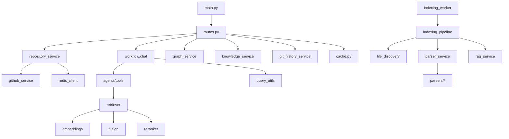

## Frontend Module Dependencies

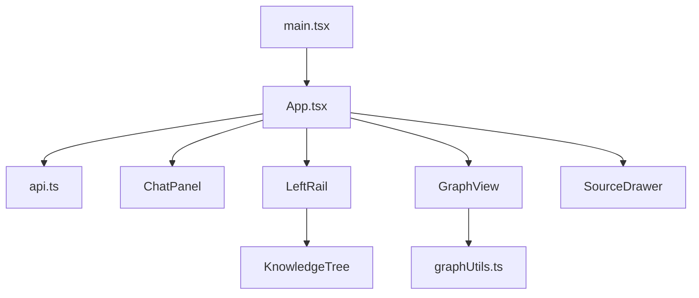

## Service Dependencies (Runtime)

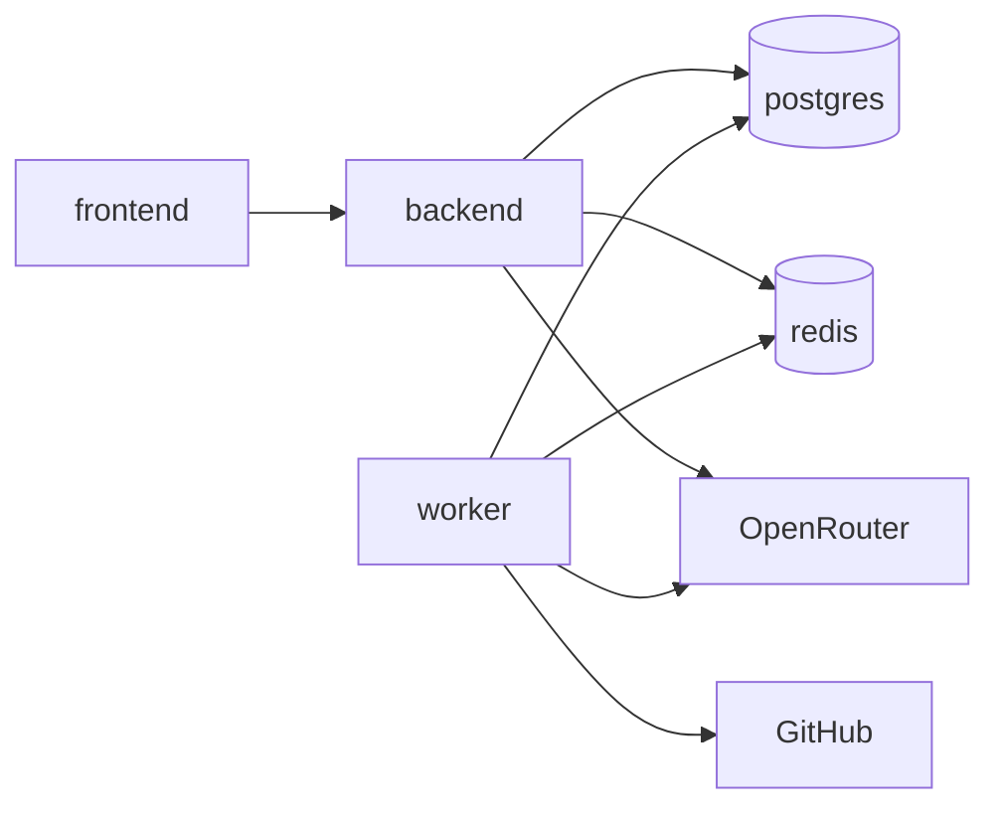

---

# 35. Startup and Shutdown Lifecycle

## `docker compose up --build` Trace

| Order | Container | What Happens |
|-------|-----------|--------------|
| 1 | **postgres** | Starts pgvector image, mounts `init.sql`, runs `CREATE EXTENSION vector`, healthcheck `pg_isready` |
| 2 | **redis** | Starts Redis 7, healthcheck `PING` |
| 3 | **backend** | Waits for healthy postgres+redis, builds if needed, runs uvicorn, `init_db()` creates all tables + alters, healthcheck hits `/api/health` |
| 4 | **worker** | Waits for healthy postgres+redis, `init_db()`, starts BLPOP loop |
| 5 | **frontend** | Waits for healthy backend, serves static `dist` on 3000 |

## Per-Container Runtime Process

| Container | Process |
|-----------|---------|
| postgres | PostgreSQL server |
| redis | redis-server |
| backend | uvicorn ASGI |
| worker | python -m app.workers.indexing_worker |
| frontend | serve -s dist |

## Graceful Shutdown

| Container | Behavior |
|-----------|---------|
| backend | Uvicorn stops accepting; in-flight HTTP completes |
| worker | SIGTERM mid-job → job may stall FAILED or partial state; no graceful drain |
| postgres/redis | Docker stop sends SIGTERM; volume persists |
| frontend | Static server exits immediately |

**Gap:** Worker should trap SIGTERM, finish current job or re-RPUSH payload.

---

# 36. End-to-End Data Flow

## User Asks: "Where is create_app defined?"

```
1. UI (ChatPanel)
   └─ POST /api/repositories/{id}/chat {"message":"Where is create_app defined?"}

2. API (routes.chat_repo)
   ├─ check_rate_limit (Redis INCR)
   ├─ cache_get → miss
   └─ agent_chat()

3. Agent (workflow.chat)
   ├─ Load/create Conversation
   ├─ Load prior Messages → format_history
   ├─ Insert user Message
   └─ run_agent() → LangGraph

4. LangGraph Node: classify
   └─ kinds = ["RAG", "CODE"]  (keyword "defined")

5. LangGraph Node: retrieve
   ├─ rewrite_query → rewrites + symbols ["create_app"]
   ├─ For each rewrite: hybrid_retrieve()
   │   ├─ embed query → vector_search (pgvector <=>)
   │   ├─ keyword_search (FTS search_tsv)
   │   ├─ symbol_search (ILIKE symbols)
   │   ├─ expand_graph_neighbors
   │   ├─ reciprocal_rank_fusion
   │   └─ heuristic_rerank → top chunks
   ├─ search_symbol("create_app")
   └─ Return merged chunks

6. LangGraph Node: compose_answer
   ├─ Dedupe chunks by file:lines
   ├─ build_answer_messages (system + context blocks)
   └─ chat_completion → LLM answer with path:line citations

7. LangGraph Node: source_check
   ├─ is_grounded(answer, chunks)?
   ├─ If no: stricter rewrite via LLM
   └─ If still no: ungrounded_refusal()

8. Persistence
   ├─ Insert assistant Message with sources JSONB
   ├─ commit
   └─ cache_set (if first message)

9. Response → UI
   ├─ Render answer bubble
   ├─ Show Key Files buttons
   └─ User clicks citation → GET file → SourceDrawer highlights lines
```

## Indexing Data Flow (Analyze)

```
GitHub URL
  → parse_github_url + GitHub API metadata
  → Repository row (CREATED)
  → POST /index → IndexingJob + Redis RPUSH
  → Worker BLPOP
  → git clone to /data/{uuid}
  → discover_files (filtered walk)
  → Tree-sitter parse → symbols + dependencies
  → rebuild_graph + rebuild_knowledge_tree
  → chunk_repository → code_chunks + search_tsv
  → embed_chunks → OpenAI embeddings API → update embedding column
  → status COMPLETED
  → UI polls → GET tree, graph, files
```

---

# Appendix A: Key File Path Index

| Concern | Path |
|---------|------|
| App entry | `backend/app/main.py` |
| All routes | `backend/app/api/routes.py` |
| Settings | `backend/app/config.py` |
| ORM models | `backend/app/models/__init__.py` |
| Index pipeline | `backend/app/services/indexing_pipeline.py` |
| Worker | `backend/app/workers/indexing_worker.py` |
| Agent | `backend/app/agents/workflow.py` |
| Hybrid search | `backend/app/rag/retriever.py` |
| Compose | `docker-compose.yml` |
| Env template | `.env.example` |
| UI root | `frontend/src/App.tsx` |

---

# Appendix B: Status Enum Reference

**RepoStatus / JobStatus (identical values):**
`CREATED → QUEUED → CLONING → ANALYZING → PARSING → GRAPH_BUILDING → CHUNKING → EMBEDDING → COMPLETED | FAILED`

---

*End of PROJECT ARCHITECTURE HANDBOOK*

